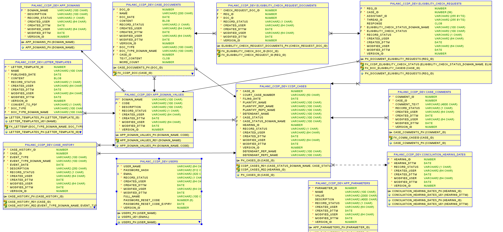
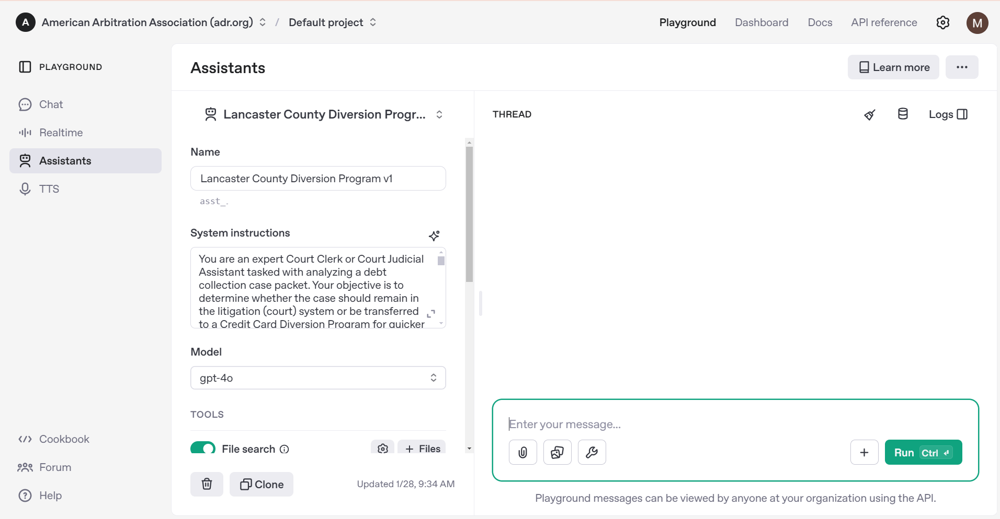
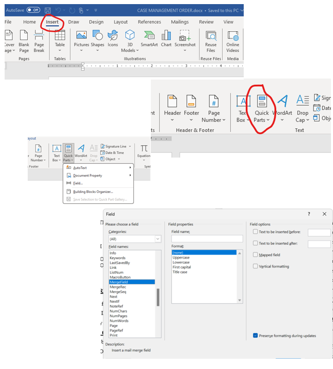
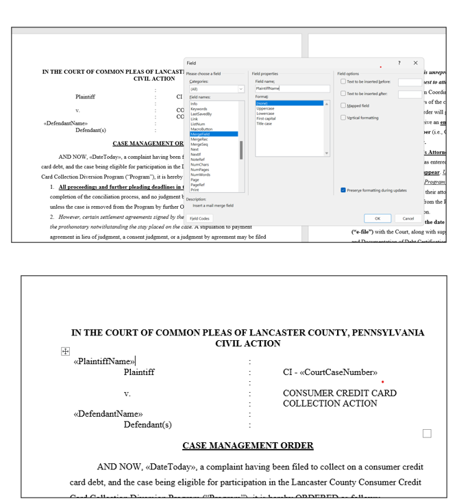


# Lancaster Credit Card Diversion 

## Overview
The Lancaster Credit Card Diversion Project is a web application designed to streamline credit card diversion case management using advanced document parsing, AI-driven insights, and robust database operations.

---

## Prerequisites

### Tools
- **.NET SDK**: Version 8.0 or higher
- **Oracle Database**: Configured with a valid connection
- **Azure Account**: For Document Intelligence API
- **Syncfusion License Key**: Required for Syncfusion components
- **OpenAI API Key**: For AI Assistant and SmartComponents integration
- **SMTP Server**: For email notifications

### Required NuGet Packages

| Package                             | Version              |
|-------------------------------------|----------------------|
| Azure.AI.DocumentIntelligence       | 1.0.0-beta.3         |
| DocumentFormat.OpenXml              | 3.1.0                |
| MailKit                             | 4.8.0                |
| Microsoft.EntityFrameworkCore       | 8.0.8                |
| Microsoft.EntityFrameworkCore.Tools | 8.0.8                |
| Microsoft.Extensions.Caching.Memory | 9.0.0                |
| Microsoft.VisualStudio.Web.CodeGeneration.Design | 8.0.5 |
| MimeKit                             | 4.8.0                |
| NLog.Web.AspNetCore                 | 5.3.13               |
| Oracle.EntityFrameworkCore          | 8.23.50              |
| SmartComponents.AspNetCore          | 0.1.0-preview10148   |
| SmartComponents.Inference.OpenAI    | 0.1.0-preview10148   |
| Syncfusion.DocIO.Net.Core           | 27.1.56              |
| Syncfusion.DocIORenderer.Net.Core   | 27.1.56              |
| Syncfusion.EJ2.AspNet.Core          | 27.1.50              |
| Syncfusion.PDF.OCR.Net.Core         | 27.1.58              |
| Syncfusion.PdfToImageConverter.Net  | 27.1.58              |
| System.Data.SqlClient               | 4.8.6                |
| System.Drawing.Common               | 8.0.8                |
| System.IO.Packaging                 | 9.0.0                |
| System.Text.Json                    | 9.0.0                |

---

## Setup Instructions

1. **Clone the Repository**  
   ```bash
   git clone <repository-url>
   cd <repository-folder>
   ```

2. **Restore Dependencies**  
   ```bash
   dotnet restore
   ```

3. **Configure `appsettings.json`**  
   Update the configuration with your credentials:
   ```json
   {
     "ConnectionStrings": {
       "LancasterCreditCardDiversion-palanc-Connection": "Your Oracle Database connection string"
     },
     "Syncfusion": {
       "LicenseKey": "Your Syncfusion License Key"
     },
     "Smtp": {
       "Username": "Your SMTP username",
       "Password": "Your SMTP password",
       "Host": "Your SMTP host"
     },
     "SmartComponents": {
       "ApiKey": "Your OpenAI API Key",
       "DeploymentName": "gpt-3.5-turbo",
       "ApiBaseUrl": "https://api.openai.com/v1"
     },
     "AssistantOpenAIId": "Open AI Assistant ID",
     "Azure": {
       "FormRecognizer": {
         "Endpoint": "Your Azure Endpoint for Document parsing",
         "ApiKey": "Your Azure API Key"
       }
     }
   }
   ```

4. **Database Setup and Relational Diagram**
    - Database schema exported file (.sql) is located in `OracleSQLServer_Export` folder
    - PALANC_CCDP_DEV is the schema name
    
    

    #### Option 1 : Use your own schema
     If you want to use a different schema name and tablespace:
     - Open the .sql file in a text editor.
     
    **Find and Replace:**
    - Replace all occurrences of `PALANC_CCDP_DEV` with your preferred schema name.
    - Replace all occurrences of `PALANC_CCDP_TABLESPACE` with your preferred tablespace name.
    - Import the modified `.sql` file into your Oracle database using SQL Developer or SQL*Plus.
    
    #### Option 2: Use the provided schema
    If you prefer to use the existing schema:
    - Create a new schema in your Oracle Database with the name `PALANC_CCDP_DEV`.
    ```
        CREATE USER PALANC_CCDP_DEV IDENTIFIED BY YourPassword;
        GRANT CONNECT, RESOURCE TO PALANC_CCDP_DEV;
        ALTER USER PALANC_CCDP_DEV DEFAULT TABLESPACE PALANC_CCDP_TABLESPACE;

    ```
    - Create a new Tablespace named `PALANC_CCDP_TABLESPACE`
    ```
        CREATE TABLESPACE PALANC_CCDP_TABLESPACE 
        DATAFILE 'palanc_ccdp_tablespace.dbf' SIZE 100M AUTOEXTEND ON;

    ```
    - Import the provided `.sql` file into the new schema. Or you can open the `.sql` file and run the script in your Oracle SQL Server.
    - Update the connection string in `appsettings.json` with the new schema name.

    **Note:** The records of these tables will be prefilled
    `APP_DOMAIN_VALUES`, `APP_DOMAINS`, `APP_PARAMETERS`, `LETTER_TEMPLATES` and `CONCILIATION_HEARING_DATES`

5. **Build and Run the Application**  
   ```bash
   dotnet build
   dotnet run
   ```

                  
6. **Dummy login credentials are**
   - `Username - "admin"`
   `Password - "admin123"`
---

## Migrating and Scaffolding Database Models 
   
      
   **Scaffolding Database Models (Recommended)**

   Use this if the schema is database-first approach, to reflect the db changes in your code.
   ```
    Scaffold-DbContext 'Your Oracle Connection String' Oracle.EntityFrameworkCore -Schemas PALANC_CCDP_DEV -OutputDir Models -f -Context PaLancCcdpDevDbContext -NoOnConfiguring
   ```
   For SSMS: 
   ```
    Scaffold-DbContext 'Your SSMS Connection String' `
    -Schemas PALANC_CCDP_DEV `
    -OutputDir Models `
    -Context PaLancCcdpDevDbContext `
    -NoOnConfiguring `
    -f 
   ```

   **Migrating Database Models**

   Use this if your schema is managed in code-first development, use migrations to apply changes to your database without manually modifying the schema.
  
  ```
    dotnet ef migrations add <MigrationName> -c YourDbContext
    dotnet ef database update -c YourDbContext
   ```
 

**Note**:  
- Comment out this below section in `OnModelCreating` method in the `PaLancCcdpDevDbContext.cs` file to avoid errors when running the application with different schemas for different environments:

   ```
        modelBuilder
            .HasDefaultSchema("SCHEMA_NAME_")
            .UseCollation("USING_NLS_COMP");
   ```


## Features

1. **Document Intelligence**: Uses Azure Form Recognizer to extract text and data from documents for automated processing.
2. **AI-Powered Insights**: Leverages OpenAI's GPT Assistant for answering prompts.
3. **AI Smart Components**: Autofill form on case creation using copied text from clipboard.
4. **Rich UI**: Syncfusion components provide powerful document and PDF processing features.
5. **Email Notifications**: Configured SMTP settings allow for automated email communication.
6. **Database Management**: Oracle Entity Framework Core handles database interactions efficiently.
7. **Detailed Logging**: NLog ensures robust log tracking for debugging and monitoring.

---

## Folder Structure

- **Program.cs**: Application entry point and service registrations.
- **appsettings.json**: Configuration file for API keys, database connections, and other settings.
- **Models/**: Contains database models scaffolded from the Oracle schema.
- **Services/**: Includes service classes like `EmailService` and `OpenAIService`.
- **ViewModels/**: Houses the application’s view models.
- **Data/**: Database context and related configurations.
- **Controllers/**: Responsible for handling HTTP requests, routing, and coordinating interactions between the models, views, and services.
- **Views/**: Contains the application’s HTML templates.
- **wwwroot/**: Static files like images, CSS, and JavaScript.
- **OracleSQLServer_Export/**: Contains the exported Oracle SQL Server schema file.

---

## Setup Smart Paste and AI Eligibility Check

### Smart Paste
- The Smart Paste feature allows users to copy text from a document or webpage and paste it into the application to autofill form fields by just clicking on the button.
- What it essentially does is, it reads the copied text from the clipboard and fills the form fields with the relevant data when we click the button.
- For better autofill, we have given prompts in the html input tags using `data-smartpaste-description` , eg: In CreateCase.html
```
 <div id="plaintiffNameGroup">
   <ejs-textbox id="plaintiffName" required="required" type="text" placeholder="Plaintiff Name" data-smartpaste-description="This field should contain the Plaintiff's company name (e.g., BANK OF AMERICA NA), not an individual human name. Always paste the company name associated with the Plaintiff." asp-for="PlaintiffName" FloatLabelType="Auto" ejs-for="@Model.PlaintiffName"></ejs-textbox>
 </div>
```

Note: 
- For Smart Paste to work, the website has to be https enabled. If not you can add exception as safe website and enable Clipboard access.
- Currently a workaround JavaScript function is used to interchange the Plaintiff/Defendant Rep names while pasting in the input textboxes on `Create Case` page, as the clipboard copies it in the reverse order from the County Suite dashboard page.

### AI Eligibility Check

Create an Assistant in the OpenAI Playground with a well-defined prompt, model, temperature settings, and file upload options. 
This Assistant ID is later used for various document processing and validation functions, such as associating it with a Vector Store for document search and analysis.

  
  
- Can be run during case creation or triggered manually later.
- Results appear in the **Eligibility Requests** tab or in the **Case Document** tab.
- Eligibility on case document always show most current review on all view summary links. For actual submission history, go to Eligibility Requests table.

**Note**: If the eligibility results appear incorrect or unexpected, contact your development team. They can review and update the predefined script that governs the eligibility checks.

### Process:
- First, it validates input documents and fetches their metadata.
Calls `ProcessDocumentsAsync()` to extract text content and count words. AnalyzeDocumentFromBytesAsync() → Uses Azure AI Document Intelligence for text extraction.
#### If document processing is successful, it:
- Creates a Vector Store (CreateVectorStoreAsync()).
- Uploads the document text to OpenAI (UploadFileAsync()).
- Stores the uploaded files in the Vector Store (StoreFilesInVectorStoreAsync()).
- Updates the AI Assistant with the Vector Store (UpdateAssistantAsync()).
- Creates a Thread (CreateThread()) to track processing status.
- Runs assistant to perform the check (RunAssistant()).
- Monitors the AI Response (CheckRunStatus() → GetAssistantResponse()).
- DeleteUploadedFileFromOpenAI() to remove temporary files and DeleteVectorStore() to delete the Vector Store after processing.

If the AI scan was enabled:
- Navigate to the **Merge Letters** tab.
- Locate the scanned file.
- Click **View Results** to review the AI's assessment.

## Notes

### Services/CaseStatusClass.cs
- Located in the `Services` folder, this class:
  - Manages mappings for CSS class names, background colors, and text colors for UI representation based on case status in the Conciliation Management Page.
  - Maps document types to case statuses for automatic updates when a document is merged or updated.
  - These mappings are passed as `ViewBag` to the required pages, such as `Conciliation Management` and `CaseDocs`, for seamless integration.

### Background Process
- The `TimeHostedCheckEligibilityService.cs` file in the `Services` folder is triggered every 60 seconds (adjustable) on the following line:
  ```csharp
  _timer = new Timer(CheckQueuedDocs, null, TimeSpan.Zero, TimeSpan.FromSeconds(60));
  ```
  - Located in `Program.cs` and starts when the application is launched.
  - Polls the `EligibilityCheckRequests` table for queued or in-progress documents and calls OpenAIService functions as necessary.
  - Uses a semaphore to ensure one task runs at a time.
 
### Creating template with Merge Fields in Word Doc

- Place the cursor at the place where you want to insert the MergeField
- Follow the image references for the next steps- 

-   
-   
    

### Merge Fields for Word Doc Merging

- The `SessionAndMergeFieldManagerService` file, located in the `Services` folder, is responsible for managing session variables and merge fields. These merge fields are dynamically set using session data and are populated based on the details provided by the user or from the documents that are merged or added to the application.
- These merge fields should be added in the Word document as placeholders to be replaced by actual values when the document is merged.
  - **Example**:  
    “AND NOW, «DateToday», a complaint having been filed to collect on a consumer credit card debt, ….”

- Below is the list of merge fields managed by this service:

  - `CurrentCaseId`
  - `CourtCaseNumber`
  - `PlaintiffName`
  - `PlaintiffRepName`
  - `PlaintiffRep2Name`
  - `DefendantName`
  - `DefendantRepName`
  - `DefendantRep2Name`
  - `DefendantCopiesTo`
  - `HearingDate`
  - `HearingDatePrevious`
  - `FilingDate`
  - `DateToday`
  - `CMODate`
  - `NCODate`
  - `RTSCCODate`
  - `CDPLFDate`
  - `CDNCODate`

---

## Troubleshooting and Common Issues

### Common Issues
1. Verify API keys for Azure, Syncfusion, and OpenAI are correctly configured.
2. Ensure Oracle Database is running and accessible.
3. Check NuGet package versions for compatibility with .NET 8.0.

### Merge Field Doesn’t Appear?

- Ensure the merge field is typed correctly in the template.
- Check if the corresponding value exists in the case.
- For date-based fields, ensure the relevant document (e.g., CMO) has been uploaded or merged.

### `HearingDatePrevious` Incorrect?

- Set the **prior hearing date**, save the case.
- Then edit the case and set the **new date**, and save again.
- This ensures the system can track both current and previous hearing dates correctly during the merge

### Page Not Responding?
- Refresh using **Ctrl + Shift + R** (Windows) or **⌘ + Shift + R** (Mac).
- Clear your browser cache.

### Editing Outside the App?
- Refresh using **Ctrl + Shift + R** (Windows) or **⌘ + Shift + R** (Mac).
